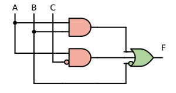
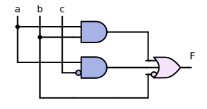
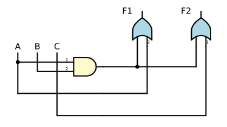
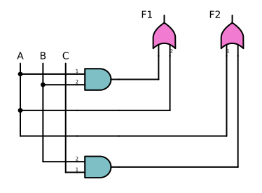

# Logigram
[](https://github.com/PoliUniLu/logigram/actions?workflow=Tests)
[](https://codecov.io/github/PoliUniLu/logigram)

Logigram is a Python library for drawing logic diagrams.

## Description
Logic diagrams are used for visualizing Boolean structures.
LOGIGRAM is a package for visualizing Boolean functions in disjunctive normal 
form (DNF). Resulting diagrams will thus consist of disjunctions of
conjunctions of literals. As inputs and outputs, LOGIGRAM can process either
binary or multivalent factors. The package was developed as an essential part
of the Python package CORA (Combinational Regularity Analysis).
CORA is a configurational comparative method for the analysis of Boolean
causal structures.

 

## Installation
 
 Use the package manager [pip](https://pip.pypa.io/en/stable/) to install LOGIGRAM.
  
  ```bash
  pip install git+https://github.com/PoliUniLu/Logigram.git
  ```
  
## Usage
 
 ```python
  import logigram
  
  # binary function, case-based notation
  f= logigram.draw_schem(['A*B+c*A+b<=>F'],color_or = '#aed49c',color_and = '#f3aea0',
                  notation='case')
  
  # binary function, lower case prime notations
  f= logigram.draw_schem(["a*b+c'*a+b'<=>F"],color_or = '#f4e4fc',color_and = '#a7b2e6',
                  notation='prime')
  
  # multi-value function 
  f = logigram.draw_schem(['A{1}*B{2}+C{0}<=>F'],color_or = 'lightblue',color_and = 'lemonchiffon',
                          notation='case')
  # multiple functions/outputs
  f = logigram.draw_schem(['A{1}*B{2}+A{2}<=>F1','A{1}+C{1}*B{2}<=>F2'], color_or='#f17bd0',
                            color_and='#7dbfc5',
                            notation='case')

  # save the figure 
  logigram.save_figure("image","svg")
  ```
## Visuals
  
  
  
  
  
  
  

## License
Logigram is licensed under a GNU GPLv3. 

## Contribution 

We welcome contributions from the community.
We encourage and recommend that feedback, bug reports, and feature requests should first be documented as an [Issue](https://github.com/PoliUniLu/cora/issues) on GitHub.

### Pull requests
To set up a development environment, use [Poetry](https://python-poetry.org/).
```console
pip install poetry
poetry install
```
Test the code by running
```console
poetry run pytest
```
Pull requests are welcome. Note that although the current codebase doesn't have entirely 
consistent code style the new code should be PEP-8 compliant.
