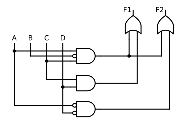
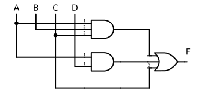
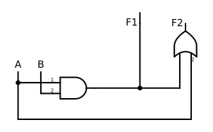

# Logigram
 Logigram is a Python library for drawing logic diagrams.

## Description
Logic diagrams are used for visualizing Boolean structures.
LOGIGRAM is a package for visualizing Boolean functions in disjunctive normal 
form (DNF). Resulting diagrams will thus consist of disjunctions of
conjunctions of literals. As inputs and outputs, LOGIGRAM can process either
binary or multivalent factors. The package was developed as an essential part
of the Python package CORA (Combinational Regularity Analysis).
CORA is a configurational comparative method for the analysis of Boolean
causal structures.

 

## Installation
 
 Use the package manager [pip](https://pip.pypa.io/en/stable/) to install LOGIGRAM.
  
  ```bash
  pip install git+https://github.com/PoliUniLu/Logigram.git
  ```
  
## Usage
 
 ```python
  import LOGIGRAM
  
  # returns a matplotlib figure
  f = logigram.draw_schem('F=A*B+c*A+b') 
  
  # for multi-output functions
  f = logigram.draw_schem(['F1=A*B+c*A+b','F2=A*B']) 
  
  # usage with multivalent factors
  f = logigram.draw_schem('F=A{1}*B{2}+C{0}')
  
  # save the figure 
  save_figure("image","svg")
  ```
## Visuals
  
  
  
  
  
  
  

## License
[](https://creativecommons.org/licenses/by-nc-sa/4.0/)
